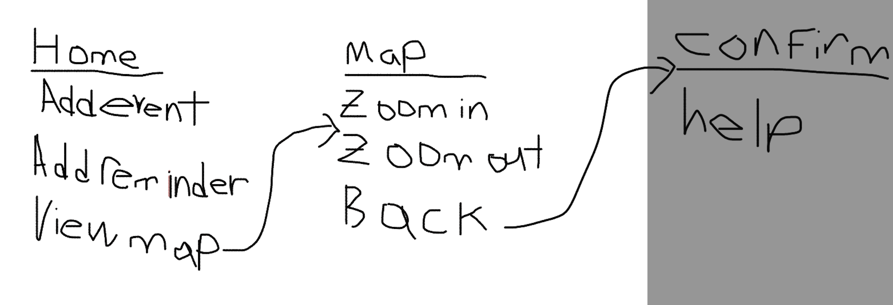

# SEG4105 Lab 3
- This is lab 3 for the SEG4105 course.
# Contributors
- Jason You (300056239)
# Shape-up pitch
- The feature will be to implement a new section within the app that will display a map of the hospital. The user should have the ability to zoom in and out and clearly identify which sections of the hospital are in the map.The size of the map should be responsive to the phone screen size. 
# Breadboard Design
