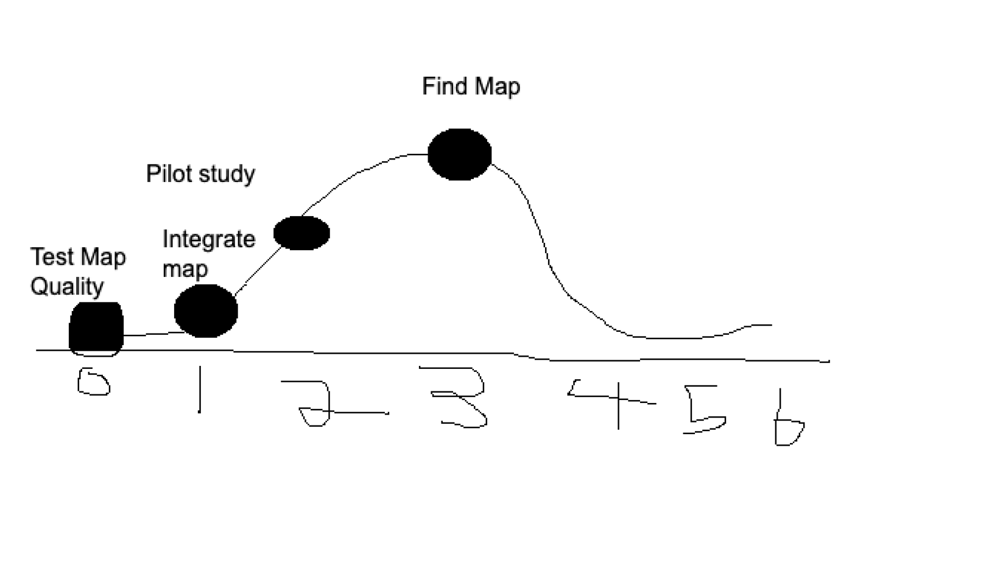

# SEG4105 Lab 7
- This file contains the necessary components for lab 7 of the SEG4105 course
# Contributors
- Jason You (Student #: 300056239)
# Daily Standup
- Yesterday, I worked on finding a map of the Children’s Hospital of Eastern Ontario (CHEO). This map will be used for the map feature of the cycle. Today, I will do research on the integration of the map and what specific component(s) are needed to allow the user to zoom in and out of the map. Currently there is an impediment where there are multiple maps for each of the different floors of the hospital. We will need to reach out to the stakeholders to determine next steps.
# Current Hill Chart status

# Current Pull Request Status
- Currently, there aren't any pull requests, but we plan to create one in the next 1-2 weeks. 
# Team meeting schedule
- We will be having our weekly meetings on Saturdays at 7 PM